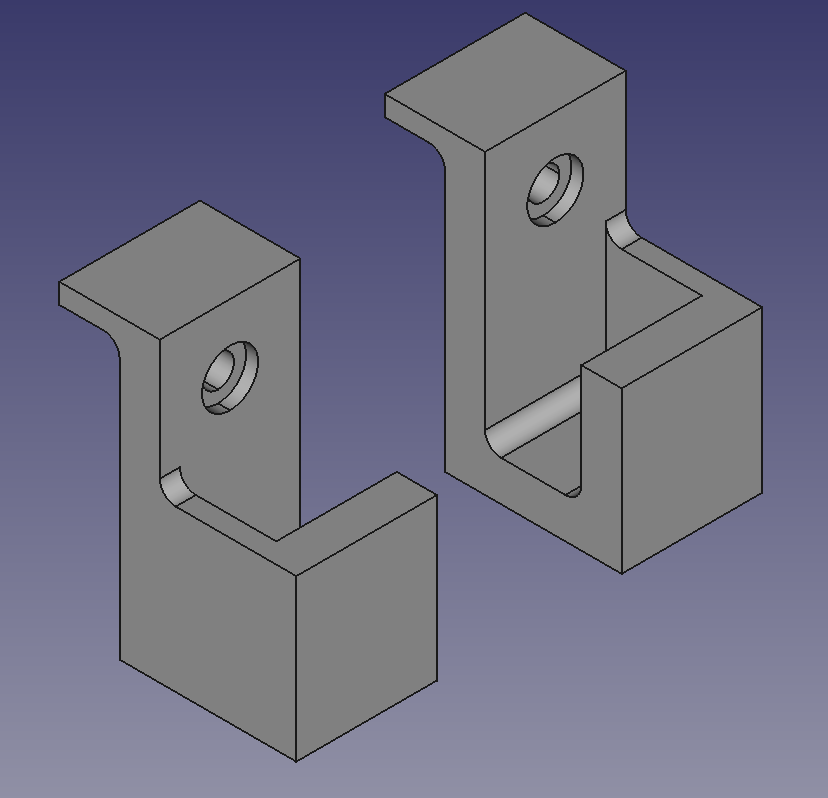
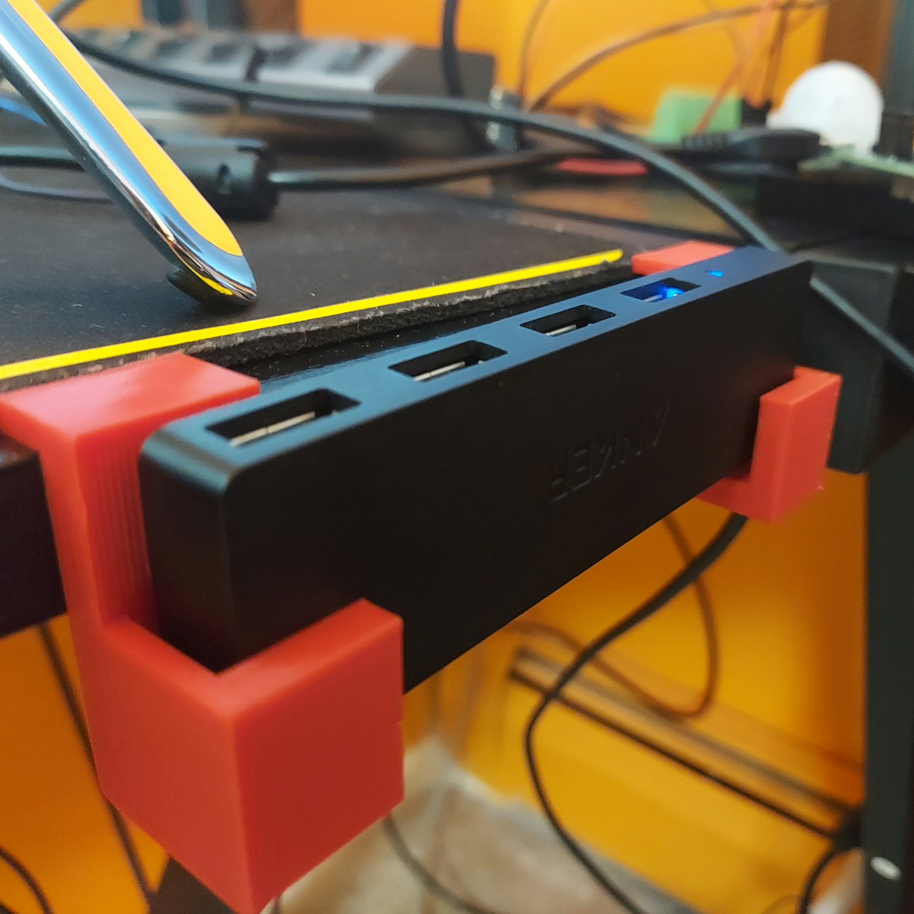

# Bench USB Hub Side Mount

This is a USB hub holder to be screwed into a desk, such as per image below

### Manufacturing
Currently the part has only been 3D printed. I have plans to make it out of wood.

### Customization
Currently this was designed for my desk and a personal USB Hub. In the future, I plan on having the dimensions editable with a spreadsheet in FreeCAD. For now, you will need to manually go thru and edit the dimensions to fit your desk and hub.
